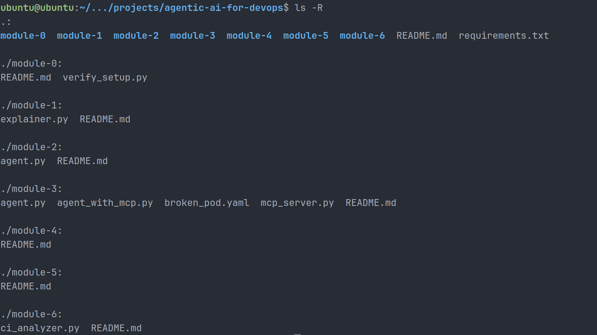
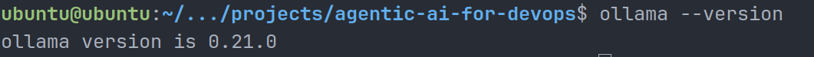
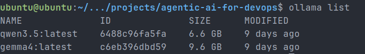
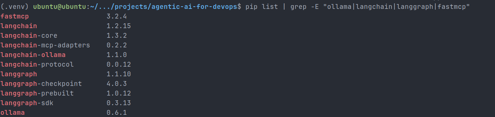
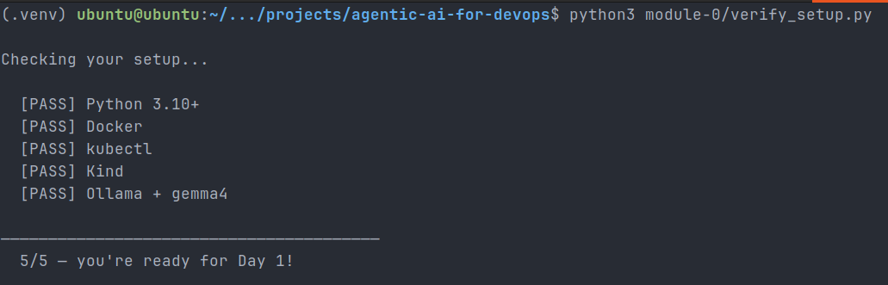
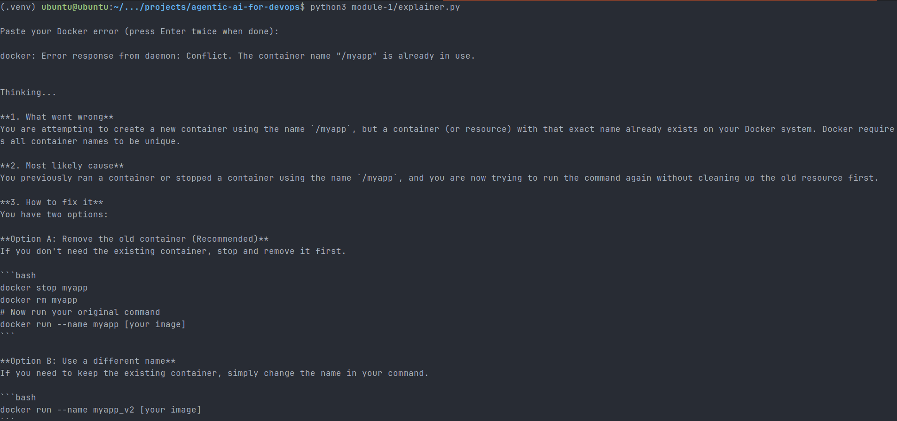
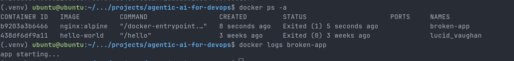
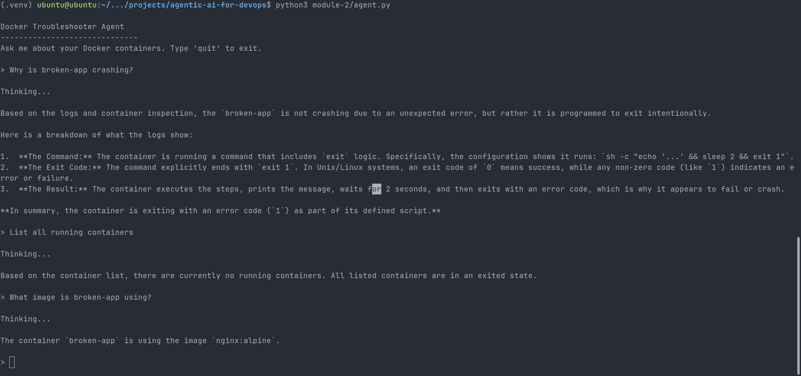
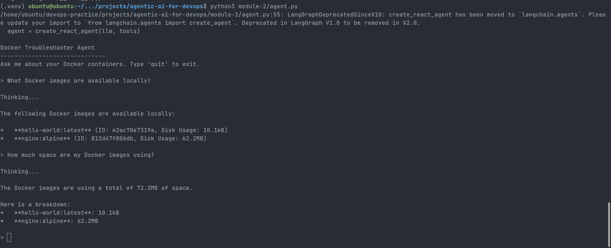

# Day 87 – Introduction to Agentic AI for DevOps

## Overview

Today marked the beginning of Agentic AI for DevOps.

After building strong foundations in Linux, Docker, CI/CD, Kubernetes, Terraform, Helm, EKS, GitOps, and observability, the next step was integrating AI into operational workflows.

The focus of Day 87 was understanding how AI agents differ from chatbots and how Large Language Models can autonomously use DevOps tools such as Docker CLI for troubleshooting and diagnostics.

This introduced a new paradigm:

Infrastructure + Tools + LLM Reasoning = Autonomous DevOps Agents

---

## Objectives

- Understand what AI agents are
- Learn the ReAct pattern (Reason → Act → Observe)
- Set up Ollama locally for running open-source LLMs
- Run Gemma4 locally
- Build a Docker Error Explainer
- Build a Docker Troubleshooter Agent
- Extend the agent with a custom Docker tool
- Understand how tool-augmented AI works in DevOps

---

## What is an AI Agent?

An AI agent is more than a chatbot.

A chatbot:

- accepts input
- generates text output

An AI agent:

- reasons about a problem
- decides what tool to use
- executes the tool
- reads output
- reasons again
- produces a final answer

Example:

Question:

Why is broken-app crashing?

Agent workflow:

1. List containers
2. Inspect container logs
3. Inspect container configuration
4. Analyze exit code
5. Produce root cause

This is autonomous troubleshooting.

---

## Why Agentic AI for DevOps?

DevOps workflows are already tool-driven.

Examples:

- docker
- kubectl
- terraform
- ansible
- aws cli
- gh cli

An AI agent can wrap these commands as tools and reason through operational problems.

Examples:

- Why is my pod crashing?
- Which container is consuming disk space?
- Which deployment failed rollout?
- Why is Terraform failing plan?
- Which EC2 instance is unhealthy?

This makes troubleshooting faster and smarter.

---

## ReAct Pattern

ReAct means:

Reason + Act + Observe

Example:

User:

Why is broken-app crashing?

Reason:

I should inspect running containers

Act:

docker ps -a

Observe:

broken-app is restarting

Reason:

I should inspect logs

Act:

docker logs broken-app

Observe:

app starting...
exit code 1

Reason:

Container exits intentionally

Final Answer:

Container crashes because startup script exits with code 1.

---

## Environment Setup

Installed:

- Ollama
- Gemma4
- LangChain
- LangGraph
- MCP adapters
- FastMCP

Verification:

PASS Python 3.10+
PASS Docker
PASS kubectl
PASS Kind
PASS Ollama + gemma4

5/5 checks passed.

Project structure after cloning the reference repository:



Ollama installed locally:



Gemma4 available in Ollama:



Python agent dependencies installed:



Setup verification passed:



---

## Project 1 – Docker Error Explainer

Built a local LLM-powered Docker troubleshooting assistant.

Input:

docker: Error response from daemon: Conflict. The container name "/myapp" is already in use.

Output:

- what went wrong
- root cause
- exact fix commands

Example fixes suggested:

```bash
docker stop myapp
docker rm myapp
```

This eliminates manual Googling of Docker errors.

Docker Error Explainer output:



---

## Project 2 – Docker Troubleshooter Agent

Created an autonomous Docker troubleshooting agent.

Available tools:

- list_containers()
- get_logs(container_name)
- inspect_container(container_name)

Agent can:

- inspect Docker state
- read logs
- inspect configuration
- reason about failures
- explain root cause

Example:

Question:

Why is broken-app crashing?

Answer:

Container intentionally exits with exit code 1 after startup.

Root cause:

```bash
sleep 2 && exit 1
```

Broken container status and logs:



Agent troubleshooting response:



---

## Custom Tool Extension

Extended agent capabilities by creating:

```python
@tool
def list_images():
```

Capabilities:

- list Docker images
- inspect image size
- calculate total disk usage

Example:

Question:

How much space are my Docker images using?

Answer:

72.3MB total

Breakdown:

- hello-world → 10.1kB
- nginx:alpine → 62.2MB

This proved custom tools can expand agent capabilities.

Custom Docker image tool output:



---

## Agent Architecture

User Question

↓

LLM (Gemma4 via Ollama)

↓

Reason

↓

Tool Selection

↓

Execute Docker CLI

↓

Read Output

↓

Reason Again

↓

Final Answer

This same architecture applies to:

- Kubernetes
- Terraform
- AWS CLI
- GitHub CLI
- Monitoring systems

---

## Key Learnings

- AI agents are tool-using systems
- ReAct is powerful for troubleshooting
- Tool descriptions matter for agent behavior
- Local LLMs can run DevOps agents privately
- Custom tools are easy to add
- DevOps automation is evolving toward autonomous operations

---

## Screenshots

All screenshots were added inline next to the relevant workflow step:

- Project setup
- Ollama version and model list
- Dependency installation
- Setup verification
- Docker Error Explainer output
- Broken container status and logs
- Agent troubleshooting output
- Custom Docker image tool output

---

## Conclusion

Day 87 introduced the future of DevOps:

AI-powered operational agents.

Today:

AI explains Docker errors

Tomorrow:

AI debugs Kubernetes

Soon:

AI heals infrastructure automatically
