# Day 88 — Multi-Tool Agents, MCP, and CI/CD Analyzer

## Overview

On Day 88, I built AI-powered DevOps operational tooling by extending a single ReAct agent across multiple infrastructure domains and exposing Kubernetes tools through the Model Context Protocol (MCP).

This project moved beyond single-purpose automation and demonstrated how Large Language Models can reason over operational tools dynamically for troubleshooting, observability, and infrastructure analysis.

---

## Objectives Completed

- Built a multi-tool DevOps agent for Docker and Kubernetes troubleshooting
- Diagnosed broken Docker containers and Kubernetes CrashLoopBackOff pods
- Built an MCP server exposing Kubernetes operational tools
- Built an MCP client agent with dynamic tool discovery
- Built a CI/CD Failure Analyzer for GitHub Actions
- Built a custom Kubernetes Log Analyzer tool
- Built a custom Terraform Plan Analyzer tool

---

## 1) Multi-Tool DevOps Agent

### Architecture

One agent with six operational tools:

### Docker Tools

- `list_containers()` → `docker ps -a`
- `get_logs(container_name)` → `docker logs`
- `inspect_container(container_name)` → `docker inspect`

### Kubernetes Tools

- `list_pods()` → `kubectl get pods`
- `describe_pod()` → `kubectl describe pod`
- `get_events()` → `kubectl get events`

### Pattern Used

```text
Question → Reason → Tool → Observe → Answer
```

This is the ReAct agent pattern.

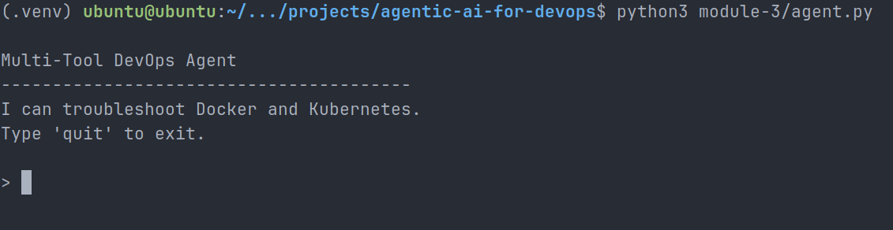

---

## 2) Failure Simulation and Diagnosis

### Docker Failure

Created intentionally broken container:

```bash
docker run -d --name broken-container nginx:alpine sh -c "echo 'container starting...' && sleep 2 && exit 1"
```

Result:

- Container exited with Exit Code `1`
- Agent detected unhealthy Docker container
- Agent used container inspection and logs for diagnosis

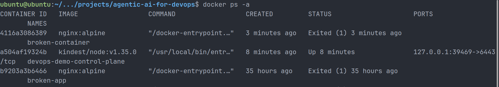

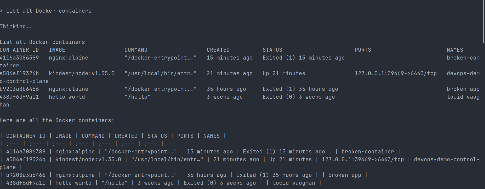

### Kubernetes Failure

Created intentionally broken pod:

```yaml
command: ["sh", "-c", "echo 'app starting...' && sleep 2 && exit 1"]
```

Result:

- Pod entered `CrashLoopBackOff`
- Kubernetes continuously restarted failed container
- Agent identified restart loop and root cause

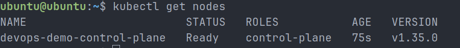

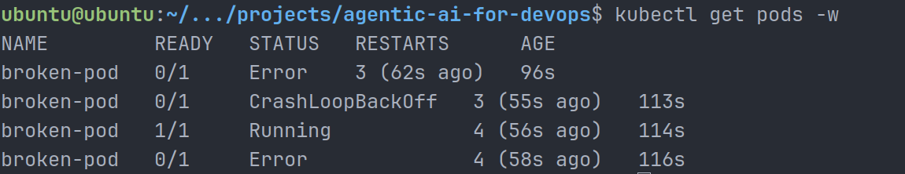

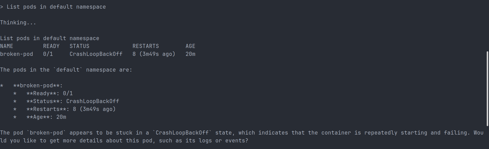

Root Cause:

```bash
exit 1
```

Container was intentionally configured to fail.

---

## 3) Model Context Protocol (MCP)

### What is MCP?

MCP (Model Context Protocol) is an open protocol that exposes tools for AI clients dynamically.

Instead of hardcoding tools inside agents:

```python
@tool
```

Tools are exposed as discoverable services:

```python
@mcp.tool
```

### Why MCP Matters

Without MCP:

- tightly coupled tooling
- framework-specific integrations
- repeated tool implementations

With MCP:

- write once, use everywhere
- reusable operational tooling
- dynamic discovery by AI clients

### MCP Architecture

```text
MCP Server
 ├── list_pods()
 ├── describe_pod()
 └── get_events()

Clients:
 ├── Claude Desktop
 ├── VS Code / Copilot
 ├── Cursor
 └── LangChain Agents
```

---

## 4) MCP Server + Client Implementation

### MCP Server

Built Kubernetes MCP server using FastMCP.

Transport:

```text
stdio
```

Exposed tools:

- list_pods
- describe_pod
- get_events

### MCP Client

LangChain client dynamically discovered tools at runtime:

```python
tools = await client.get_tools()
```

No hardcoded tool definitions required.

### Result

Agent diagnosed:

- broken pod state
- CrashLoopBackOff
- BackOff restart events
- explicit application failure (`exit 1`)

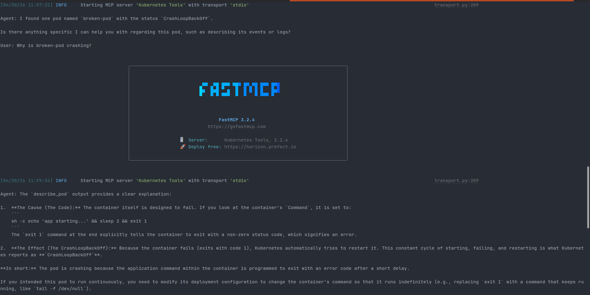

---

## 5) CI/CD Failure Analyzer

Built GitHub Actions operational analyzer using GitHub CLI.

### Tools

- `list_workflow_runs()` → `gh run list`
- `get_run_details()` → `gh run view --json ...`
- `get_workflow_file()` → read workflow YAML

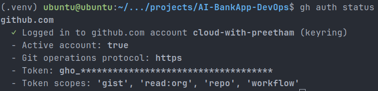

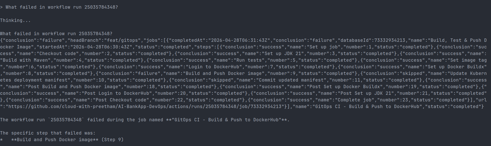

### Diagnosis Result

Workflow:

`GitOps CI - Build & Push to DockerHub`

Failed Step:

`Build and Push Docker image`

Successful Steps:

- Checkout
- JDK setup
- Maven build
- Tests
- Docker login
- Buildx setup

Skipped:

- Update Kubernetes manifest
- Commit updated manifest

Root cause isolated automatically by agent reasoning.

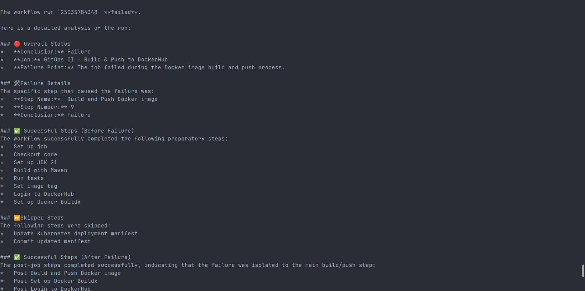

---

## 6) Custom Tool — Kubernetes Log Analyzer

Built custom operational tool:

```python
search_logs(keyword)
```

Operational equivalent:

```bash
kubectl logs + grep
```

Result:

```text
pod/broken-pod: found 'starting'
```

Use case:

- outage debugging
- log hunting
- SRE investigations

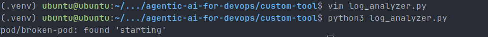

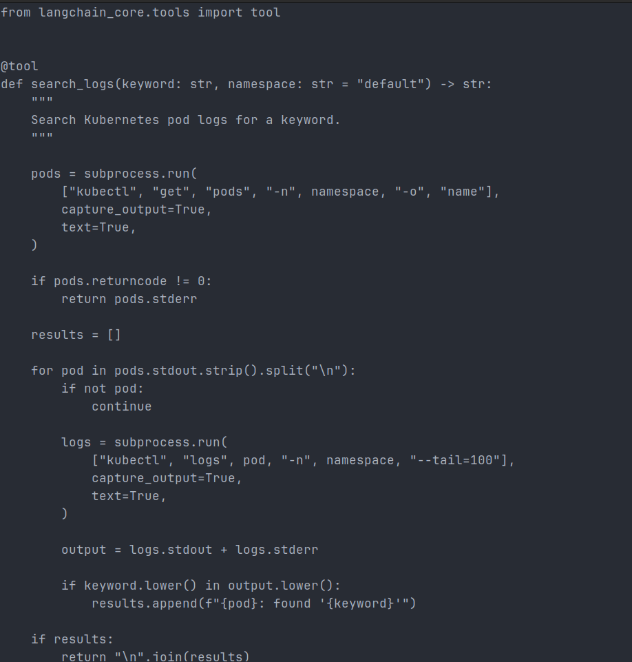

---

## 7) Custom Tool — Terraform Analyzer

Built custom infrastructure analyzer:

```python
terraform_plan(terraform_dir)
```

Operational equivalent:

```bash
terraform plan -no-color
```

Result:

Agent surfaced planned infrastructure changes including:

```text
helm_release.argocd will be created
```

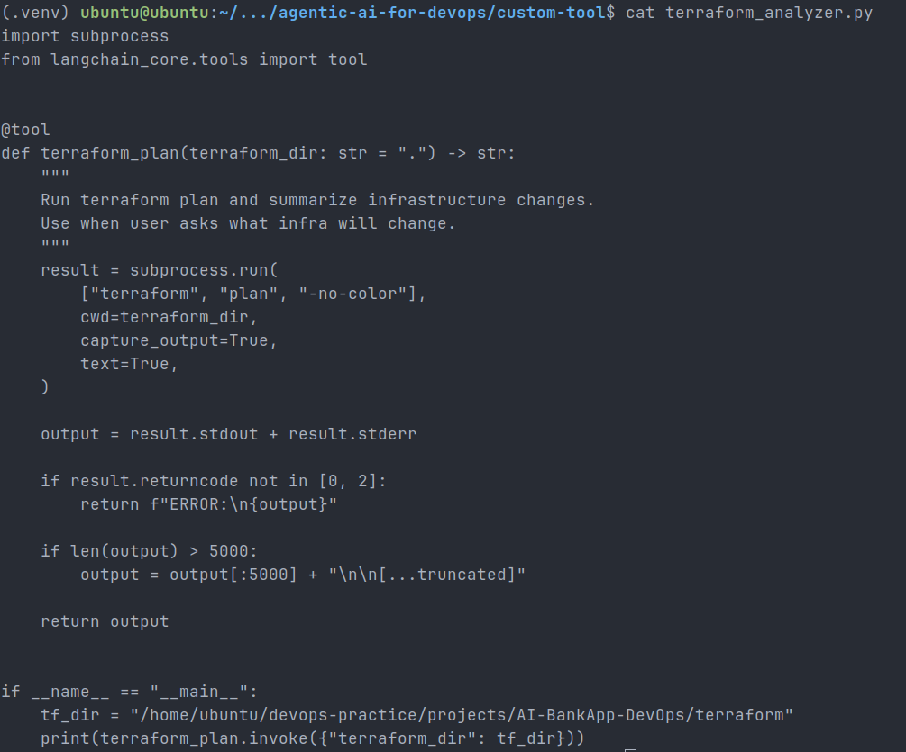

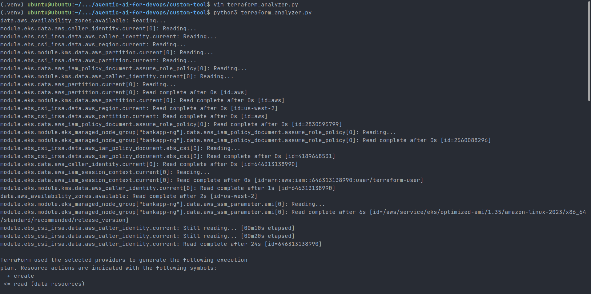

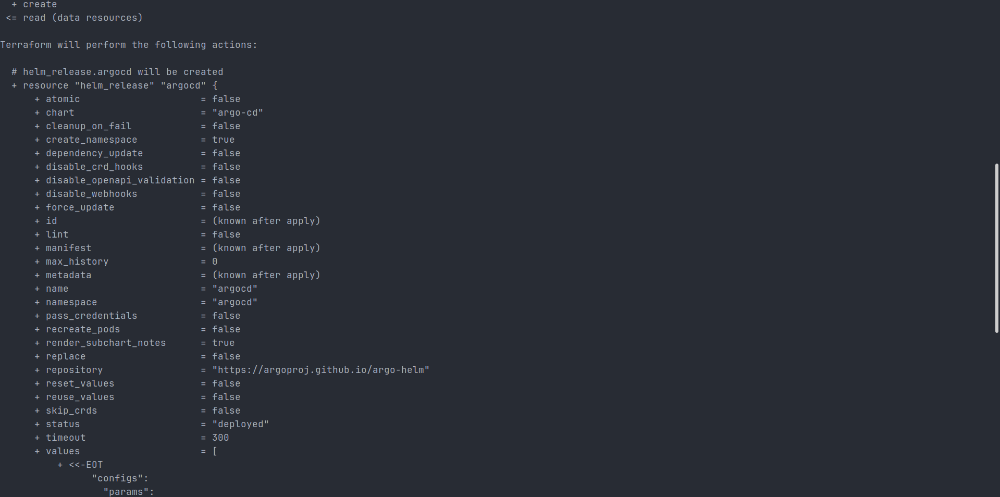

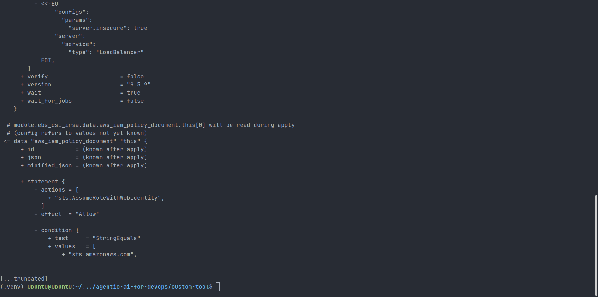

Use case:

- pre-change review
- infra drift analysis
- deployment validation

---

## Key Learnings

- Any operational CLI can become an AI tool
- ReAct pattern enables tool-based reasoning
- MCP decouples tools from agents
- Dynamic discovery is more scalable than hardcoding
- Error handling and output formatting matter for agent reliability
- LLMs become operational copilots when connected to real tooling

---

## Conclusion

Day 88 demonstrated a reusable DevOps automation pattern:

```text
CLI Command → Python Tool → Agent Reasoning → Operational Insight
```

This pattern is domain agnostic and can be extended to:

- AWS
- Terraform
- Helm
- Monitoring
- Security tooling
- Incident response systems

A powerful step toward autonomous DevOps operations.
