# Day 89 – AIOps with KubeHealer (AI-Powered Kubernetes Incident Diagnosis)

## Overview

On Day 89 of my #90DaysOfDevOps journey, I explored **AIOps (Artificial Intelligence for IT Operations)** by building and debugging **KubeHealer**—an AI-assisted Kubernetes incident diagnosis platform.

This project combined:

- Kubernetes failure simulation
- Temporal workflow orchestration
- AI-based root cause analysis
- Production guardrails for safe remediation
- Local LLM integration using Ollama

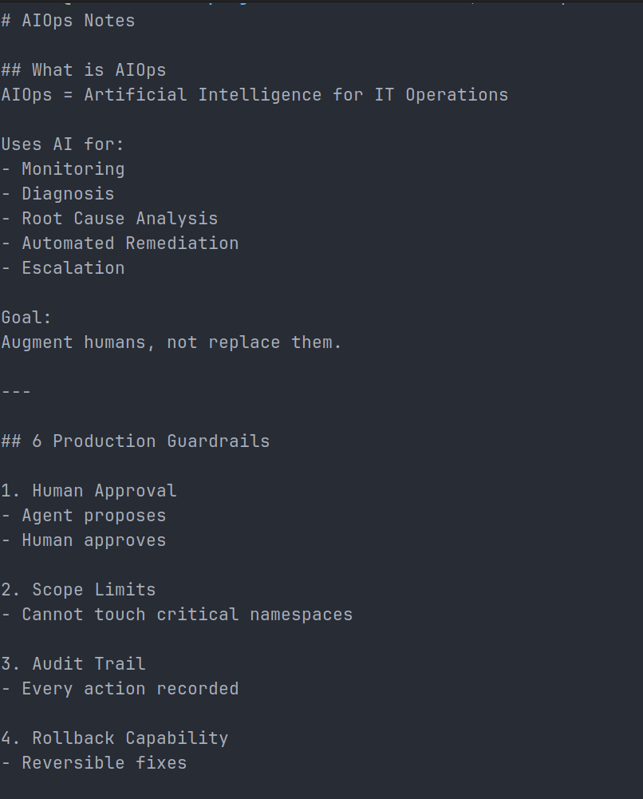

---

## Objectives

The goal was to simulate real production incidents and validate whether an AI-powered workflow could:

- Detect unhealthy pods
- Diagnose root causes
- Recommend safe remediation actions
- Escalate unsafe fixes for human approval
- Operate with workflow durability and retries

---

## Tech Stack

- Kubernetes (Kind Cluster)
- Temporal
- Python
- Ollama
- Gemma4 local LLM
- kubectl
- Linux

---

## Production Guardrails Implemented

1. Human approval for risky actions
2. Scope limitation for remediation
3. Full auditability via workflows
4. Retry + timeout handling
5. Rollback mindset
6. Escalation for unsafe configuration fixes

---

## Lab Setup

### 1) Local Kubernetes Cluster

Created a local Kind cluster for isolated testing.

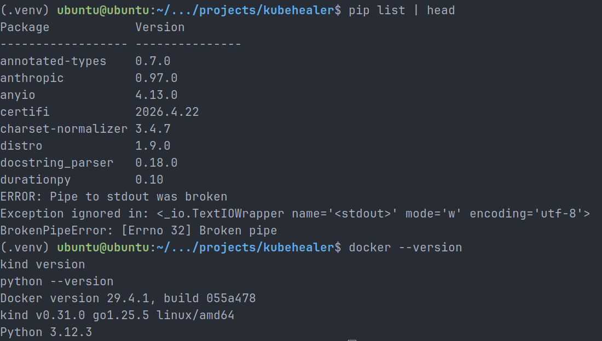

### 2) Temporal Server

Started Temporal locally to orchestrate workflows and activity retries.

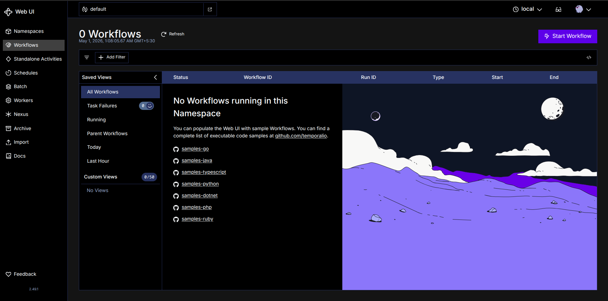

### 3) Broken Pod Scenarios

Deployed intentionally broken pods:

| Pod        | Failure                    | Cause                        |
| ---------- | -------------------------- | ---------------------------- |
| web-app    | ImagePullBackOff           | Typo in image name (`ngnix`) |
| memory-app | CrashLoopBackOff           | Memory limit too low         |
| config-app | CreateContainerConfigError | Missing ConfigMap            |

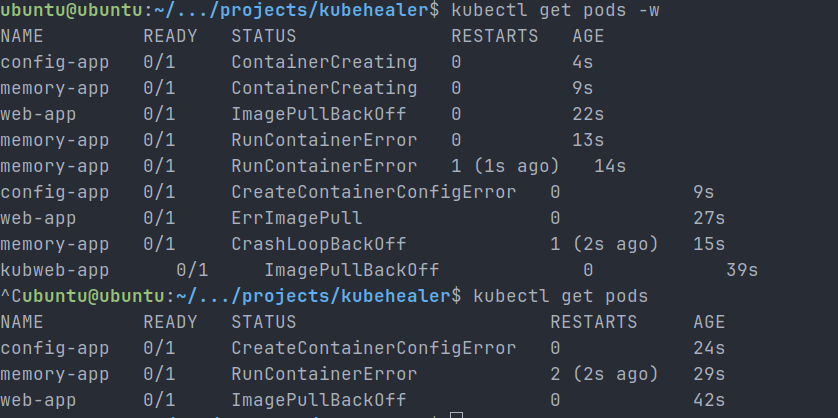

---

## Challenge Faced

The original project used Anthropic API, but billing credits blocked execution.

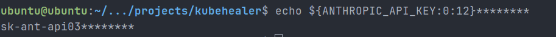

### Solution

I refactored the codebase to use local inference:

**Anthropic → Ollama → Gemma4**

Changes included:

- Replacing SDK imports
- Replacing API client calls
- Updating response parsing
- Fixing JSON extraction logic
- Switching model from qwen3.5 to gemma4 due to runtime issues

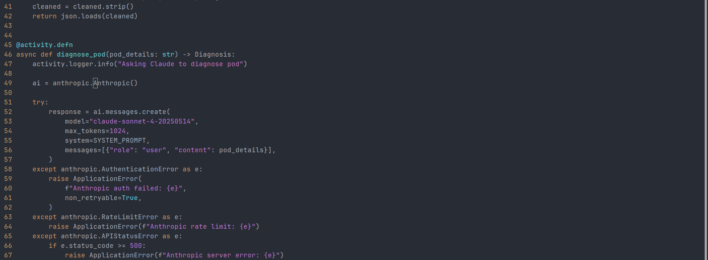

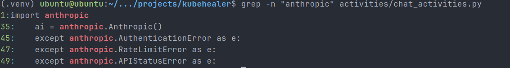

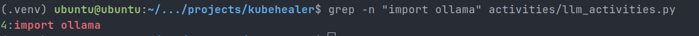

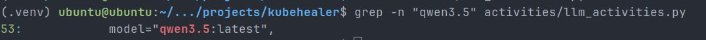

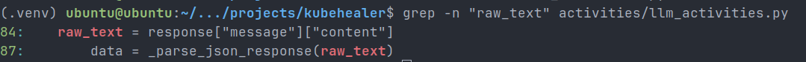

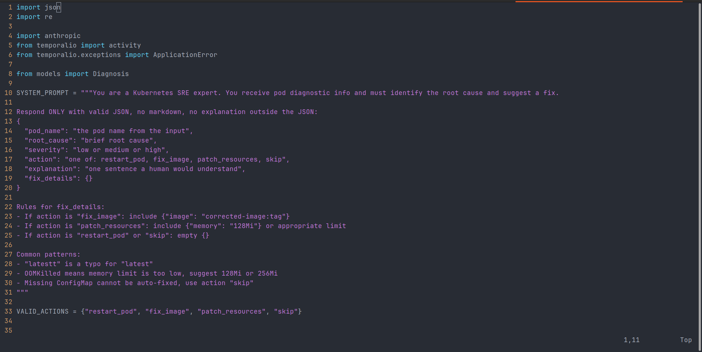

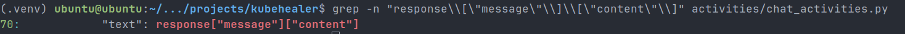

---

## AI Diagnosis Results

### config-app

Diagnosis:

- Missing ConfigMap dependency
  Action:
- Skip auto-remediation
- Escalate for human intervention

### web-app

Diagnosis:

- Typo in image name
  Action:
- Suggest image correction (`nginx:latest`)

This validated safe AIOps behavior.

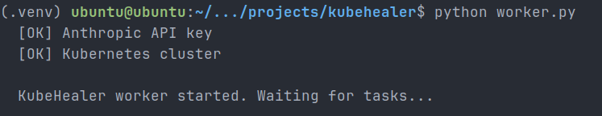

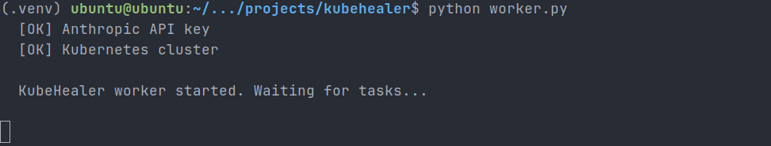

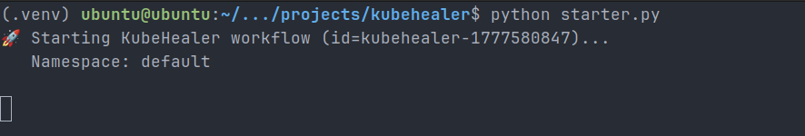

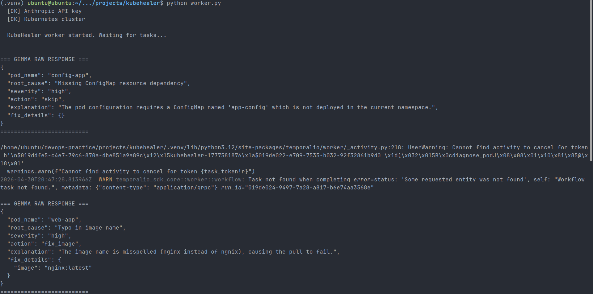

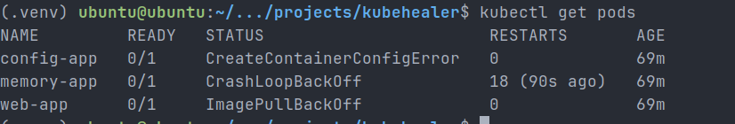

---

## Temporal Workflow Validation

Observed:

- Workflow scheduling
- Activity execution
- Retry behavior
- Timeout handling
- Multiple workflow runs during debugging

This demonstrated durable orchestration patterns used in production systems.

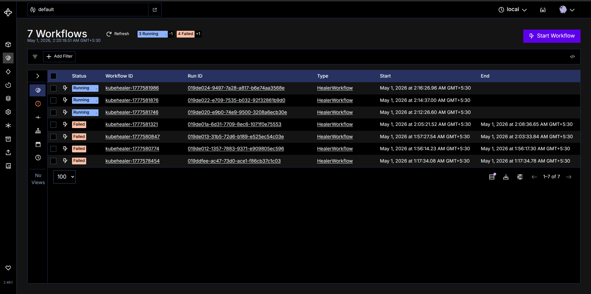

---

## Key Learnings

- AI should diagnose before acting
- Production systems need guardrails
- Local LLMs are viable for DevOps workflows
- Workflow engines like Temporal are powerful for automation durability
- Debugging distributed systems is iterative engineering

---

## Outcome

Successfully built a **local AI-powered Kubernetes diagnostic workflow** that:

- Detects failures
- Understands root causes
- Suggests remediation
- Escalates unsafe actions
- Runs without paid external APIs

A strong step toward practical AIOps engineering.
